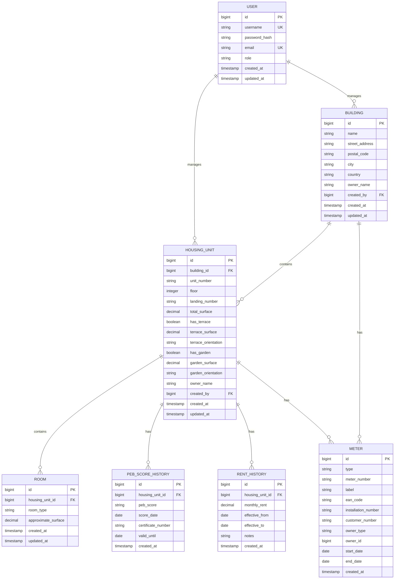

# ImmoCare - Data Model

## Overview

This document describes the data model for the ImmoCare application, which manages buildings, housing units, and associated information including PEB scores, rents, and utility meters.

## Entity Relationship Diagram



## Core Entities

### USER
**Purpose**: Manages authentication and user information.

**Attributes**:
- `id`: Primary key (auto-generated)
- `username`: Unique login name
- `password_hash`: BCrypt hashed password
- `email`: Unique email address
- `role`: User role (ADMIN)
- `created_at`, `updated_at`: Audit timestamps

---

### BUILDING
**Purpose**: Physical buildings containing housing units.

**Attributes**:
- `id`: Primary key (auto-generated)
- `name`: Building name
- `street_address`, `postal_code`, `city`, `country`: Full address
- `owner_name`: Optional owner name
- `created_by`: FK to USER
- `created_at`, `updated_at`: Audit timestamps

**Business Rules**:
- Must have a complete address
- Owner name is optional
- Deletion cascades to housing units and all related data

---

### HOUSING_UNIT
**Purpose**: Individual apartments or units within buildings.

**Attributes**:
- `id`: Primary key (auto-generated)
- `building_id`: Foreign key to BUILDING
- `unit_number`: Unit identifier (unique within building)
- `floor`: Floor number (-10 to 100)
- `landing_number`: Optional landing/staircase identifier
- `total_surface`: Total area in m² (optional)
- `has_terrace`, `terrace_surface`, `terrace_orientation`: Terrace details
- `has_garden`, `garden_surface`, `garden_orientation`: Garden details
- `owner_name`: Optional override (inherits from building if null)
- `created_by`: FK to USER
- `created_at`, `updated_at`: Audit timestamps

**Business Rules**:
- Unit number must be unique within a building
- If `owner_name` is NULL, display building's owner name
- Cannot be deleted if it has rooms, PEB scores, rent history, or meters

---

### ROOM
**Purpose**: Individual rooms within housing units.

**Attributes**:
- `id`: Primary key (auto-generated)
- `housing_unit_id`: Foreign key to HOUSING_UNIT
- `room_type`: Type of room (enumeration)
- `approximate_surface`: Surface area in m²
- `created_at`, `updated_at`: Audit timestamps

**Room Types** (enumeration):
- LIVING_ROOM, BEDROOM, KITCHEN, BATHROOM, TOILET, HALLWAY, STORAGE, OFFICE, DINING_ROOM, OTHER

**Business Rules**:
- Must belong to a housing unit
- Surface is approximate (not legally binding)
- Sum of room surfaces can be used to calculate total housing unit surface

---

### PEB_SCORE_HISTORY
**Purpose**: Tracks Energy Performance Certificate (PEB) scores over time.

**Attributes**:
- `id`: Primary key (auto-generated)
- `housing_unit_id`: Foreign key to HOUSING_UNIT
- `peb_score`: Energy performance score (A++ to G)
- `score_date`: Date when score was issued
- `certificate_number`: Official certificate identifier (optional)
- `valid_until`: Expiration date of certificate (optional)
- `created_at`: Audit timestamp

**PEB Score Values**: A_PLUS_PLUS, A_PLUS, A, B, C, D, E, F, G

**Business Rules**:
- Append-only: records are never updated or deleted
- Most recent `score_date` = current active score
- Historical scores are retained for compliance and tracking

---

### RENT_HISTORY
**Purpose**: Tracks indicative rent amounts over time.

**Attributes**:
- `id`: Primary key (auto-generated)
- `housing_unit_id`: Foreign key to HOUSING_UNIT
- `monthly_rent`: Monthly rent amount in EUR
- `effective_from`: Start date of this rent amount
- `effective_to`: End date (nullable = current rent)
- `notes`: Optional notes about rent change
- `created_at`: Audit timestamp

**Business Rules**:
- Current rent has `effective_to = NULL`
- When updating rent, previous record's `effective_to` is set to day before new `effective_from`
- Indicative only (not actual tenant payments)

---

### METER
**Purpose**: Tracks utility meter assignments (water, gas, electricity) over time for housing units and buildings.

**Attributes**:
- `id`: Primary key (auto-generated)
- `type`: Meter type — WATER, GAS, ELECTRICITY
- `meter_number`: Physical meter identifier (all types)
- `label`: Optional human-readable label (e.g. Kitchen, Basement)
- `ean_code`: Required for GAS and ELECTRICITY meters
- `installation_number`: Required for WATER meters
- `customer_number`: Required for WATER meters on a BUILDING
- `owner_type`: Polymorphic owner type — HOUSING_UNIT or BUILDING
- `owner_id`: FK to `housing_unit.id` or `building.id` (no DB-level FK — polymorphic pattern)
- `start_date`: Activation date — cannot be in the future
- `end_date`: Closure date — NULL = active
- `created_at`: Audit timestamp

**Business Rules**:
- Append-only: existing records are never modified
- Active meter = `end_date IS NULL`
- Multiple active meters of the same type are allowed per owner
- `ean_code` required for GAS and ELECTRICITY
- `installation_number` required for WATER
- `customer_number` required for WATER on BUILDING
- Replace is atomic: closes current meter and creates new one in a single transaction
- New `start_date` on replace must be ≥ current meter's `start_date`

---

## Data Integrity Rules

### Referential Integrity
- All foreign keys must reference existing records
- Cascade delete rules:
  - Delete BUILDING → cascade delete HOUSING_UNIT and all related history
  - Delete HOUSING_UNIT → cascade delete ROOM and all history tables
  - Delete USER → set created_by to NULL (retain data)
- METER uses a polymorphic owner pattern (no DB-level FK on `owner_id`) — integrity enforced at service level

### Audit Trail
- All tables have `created_at` timestamp (set on insert)
- Main entities have `updated_at` timestamp (set on update)
- History/append-only tables have only `created_at`

### Uniqueness Constraints
- USER: username, email
- BUILDING: none
- HOUSING_UNIT: (building_id, unit_number) composite unique
- ROOM: none
- History / append-only tables: none

---

## Historization Pattern

For time-based data (PEB, Rent, Meters), we use an **append-only pattern**:

1. **Append-only**: Records are never updated or deleted
2. **Time-based validity**: Use date fields to determine current vs historical
3. **Current record**: Identified by NULL end date or most recent date
4. **Corrections**: Add new record, don't modify existing

**Example — Active Meters**:
```sql
SELECT * FROM meter
WHERE owner_type = 'HOUSING_UNIT'
  AND owner_id = ?
  AND end_date IS NULL;
```

**Example — Current Rent**:
```sql
SELECT * FROM rent_history
WHERE housing_unit_id = ?
  AND effective_to IS NULL;
```

---

## Future Considerations (Backlog)

- **Tenants**: Person/entity renting the unit
- **Lease Contracts**: Formal rental agreements
- **Payments**: Actual rent payments received
- **Maintenance**: Maintenance requests and work orders
- **Documents**: File attachments (contracts, invoices, photos)
- **Portfolio Management**: Multi-owner support with complex permissions

---

**Last Updated**: 2026-02-24
**Version**: 1.1
**Status**: Up to date
