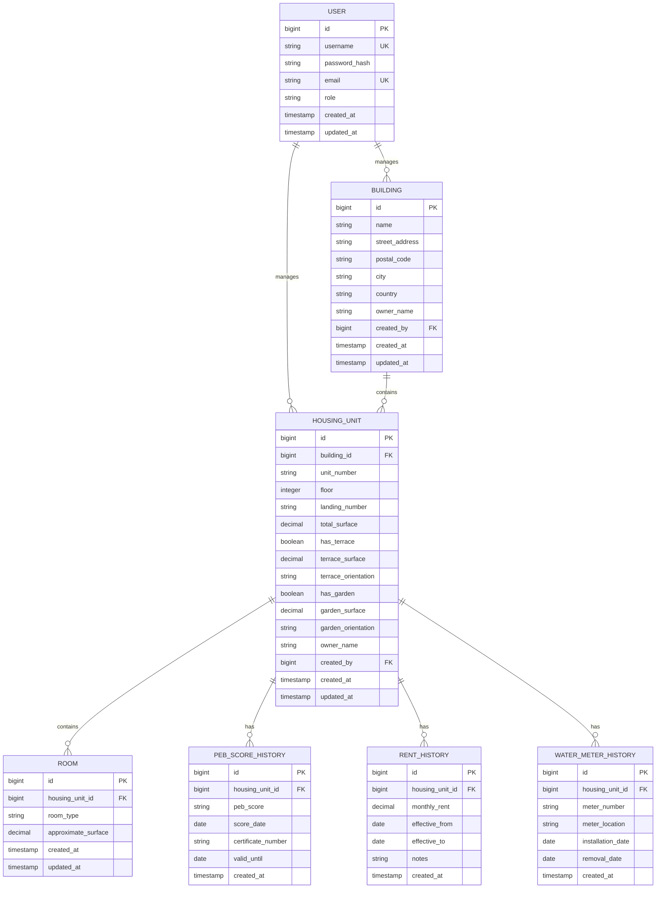

# ImmoCare - Data Model

## Overview

This document describes the data model for the ImmoCare application, which manages buildings, housing units, and associated information including PEB scores, rents, and water meters.

## Entity Relationship Diagram



## Core Entities

### USER
**Purpose**: Manages authentication and user information.

**Attributes**:
- `id`: Primary key (auto-generated)
- `username`: Unique username for login
- `password_hash`: BCrypt hashed password
- `email`: Unique email address
- `role`: User role (ADMIN for now)
- `created_at`, `updated_at`: Audit timestamps

**Business Rules**:
- Username must be unique
- Email must be unique and valid format
- Password must be hashed using BCrypt
- Role is ADMIN by default in Phase 1

---

### BUILDING
**Purpose**: Represents a physical building containing housing units.

**Attributes**:
- `id`: Primary key (auto-generated)
- `name`: Building name or identifier
- `street_address`: Street address
- `postal_code`: Postal/ZIP code
- `city`: City name
- `country`: Country name
- `owner_name`: Building owner (optional, nullable)
- `created_by`: Foreign key to USER
- `created_at`, `updated_at`: Audit timestamps

**Business Rules**:
- A building must have a complete address
- Owner name is optional at building level
- If building has an owner, housing units inherit it unless overridden
- A building can contain multiple housing units

---

### HOUSING_UNIT
**Purpose**: Represents an individual apartment or housing unit within a building.

**Attributes**:
- `id`: Primary key (auto-generated)
- `building_id`: Foreign key to BUILDING
- `unit_number`: Unit identifier (e.g., "A1", "101")
- `floor`: Floor number (integer, can be negative for basement)
- `landing_number`: Landing/staircase identifier (optional)
- `total_surface`: Total surface area in m² (can be manually entered or calculated)
- `has_terrace`: Boolean flag for terrace presence
- `terrace_surface`: Terrace surface in m² (nullable)
- `terrace_orientation`: Cardinal direction (N, S, E, W, NE, NW, SE, SW) (nullable)
- `has_garden`: Boolean flag for garden presence
- `garden_surface`: Garden surface in m² (nullable)
- `garden_orientation`: Cardinal direction (nullable)
- `owner_name`: Unit-specific owner (optional, overrides building owner)
- `created_by`: Foreign key to USER
- `created_at`, `updated_at`: Audit timestamps

**Business Rules**:
- Must belong to a building
- Unit number must be unique within a building
- Total surface can be calculated from rooms or manually entered
- Owner name inherits from building if not specified
- Terrace/garden surfaces only apply if has_terrace/has_garden is true

---

### ROOM
**Purpose**: Represents individual rooms within a housing unit.

**Attributes**:
- `id`: Primary key (auto-generated)
- `housing_unit_id`: Foreign key to HOUSING_UNIT
- `room_type`: Type of room (enumeration)
- `approximate_surface`: Surface area in m²
- `created_at`, `updated_at`: Audit timestamps

**Room Types** (enumeration):
- LIVING_ROOM
- BEDROOM
- KITCHEN
- BATHROOM
- TOILET
- HALLWAY
- STORAGE
- OFFICE
- DINING_ROOM
- OTHER

**Business Rules**:
- Must belong to a housing unit
- Surface is approximate (not legally binding)
- Sum of room surfaces can be used to calculate total housing unit surface

---

### PEB_SCORE_HISTORY
**Purpose**: Tracks Energy Performance Certificate (PEB) scores over time.

**Attributes**:
- `id`: Primary key (auto-generated)
- `housing_unit_id`: Foreign key to HOUSING_UNIT
- `peb_score`: Energy performance score (A++, A+, A, B, C, D, E, F, G)
- `score_date`: Date when score was issued
- `certificate_number`: Official certificate identifier (optional)
- `valid_until`: Expiration date of certificate (optional)
- `created_at`: Audit timestamp

**PEB Score Values** (enumeration):
- A_PLUS_PLUS (A++)
- A_PLUS (A+)
- A
- B
- C
- D
- E
- F
- G

**Business Rules**:
- One housing unit can have multiple PEB scores over time
- Score date determines which score is current
- Most recent score_date is the active PEB score
- Historical scores are retained for compliance and tracking

---

### RENT_HISTORY
**Purpose**: Tracks indicative rent amounts over time.

**Attributes**:
- `id`: Primary key (auto-generated)
- `housing_unit_id`: Foreign key to HOUSING_UNIT
- `monthly_rent`: Monthly rent amount in EUR
- `effective_from`: Start date of this rent amount
- `effective_to`: End date of this rent amount (nullable for current rent)
- `notes`: Optional notes about rent change
- `created_at`: Audit timestamp

**Business Rules**:
- One housing unit can have multiple rent records over time
- Current rent has `effective_to = NULL`
- When updating rent, previous record's `effective_to` is set to day before new `effective_from`
- Rent periods should not overlap
- This is indicative rent (not actual tenant payments - that's in backlog)

---

### WATER_METER_HISTORY
**Purpose**: Tracks water meter assignments over time.

**Attributes**:
- `id`: Primary key (auto-generated)
- `housing_unit_id`: Foreign key to HOUSING_UNIT
- `meter_number`: Unique meter identifier
- `meter_location`: Physical location description (optional)
- `installation_date`: Date meter was installed/assigned
- `removal_date`: Date meter was removed/replaced (nullable for active meter)
- `created_at`: Audit timestamp

**Business Rules**:
- One housing unit can have multiple meter records over time
- Current meter has `removal_date = NULL`
- When replacing meter, previous record's `removal_date` is set to installation_date of new meter
- Meter periods should not overlap for the same housing unit
- Future: Other utility meters (electricity, gas) will follow same pattern

---

## Data Integrity Rules

### Referential Integrity
- All foreign keys must reference existing records
- Cascade delete rules:
  - Delete BUILDING → cascade delete HOUSING_UNIT and all related history
  - Delete HOUSING_UNIT → cascade delete ROOM and all history tables
  - Delete USER → set created_by to NULL (retain data)

### Audit Trail
- All tables have `created_at` timestamp (set on insert)
- Main entities have `updated_at` timestamp (set on update)
- History tables are append-only (no updates/deletes)

### Uniqueness Constraints
- USER: username, email
- BUILDING: none (can have duplicate names)
- HOUSING_UNIT: (building_id, unit_number) composite unique
- ROOM: none
- History tables: none (allow duplicates for correction scenarios)

---

## Historization Pattern

For time-based data (PEB, Rent, Water Meter), we use a **history table pattern**:

1. **Append-only**: Records are never updated or deleted
2. **Time-based validity**: Use date fields to determine current vs historical
3. **Current record**: Identified by NULL end date or most recent date
4. **Corrections**: Add new record, don't modify existing

**Example Query Pattern** (Current Rent):
```sql
SELECT * FROM rent_history 
WHERE housing_unit_id = ? 
  AND effective_to IS NULL;
```

**Example Query Pattern** (Rent at specific date):
```sql
SELECT * FROM rent_history 
WHERE housing_unit_id = ? 
  AND effective_from <= ? 
  AND (effective_to IS NULL OR effective_to >= ?);
```

---

## Future Considerations (Backlog)

- **Tenants**: Person/entity renting the unit
- **Lease Contracts**: Formal rental agreements
- **Payments**: Actual rent payments received
- **Maintenance**: Maintenance requests and work orders
- **Other Meters**: Electricity, gas, heating meters
- **Documents**: File attachments (contracts, invoices, photos)
- **Portfolio Management**: Multi-owner support with complex permissions

---

**Last Updated**: 2024-01-15  
**Version**: 1.0  
**Status**: Draft for Review
